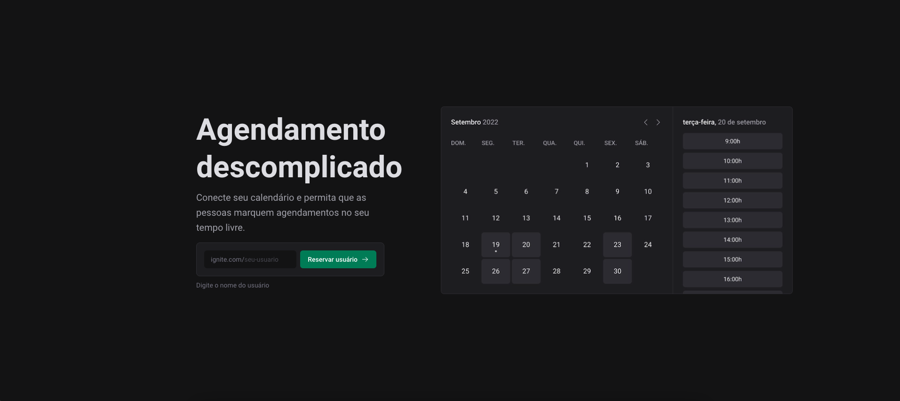

# Ignite Call

O Ignite Call é um projeto de estudo desenvolvido através da plataforma Rocketseat. Este projeto tem como objetivo permitir a realização de agendamentos entre usuários, usando um datepicker para visualizar e selecionar os dias e horários disponíveis e indisponíveis. O Ignite Call incorpora diversas tecnologias e conceitos importantes, incluindo Next.js, Prisma, Docker, Google Calendar API, Zod e autenticação com Next Auth.

## Índice

- [Tecnologias Utilizadas](#tecnologias-utilizadas)
- [Capturas de Tela](#capturas-de-tela)
- [Requisitos de Instalação](#requisitos-de-instalação)
- [Como Usar](#como-usar)
- [Contribuição](#contribuição)
- [Licença](#licença)

## Tecnologias Utilizadas

- Next.js: O Ignite Call utiliza o framework Next.js para a construção da interface de usuário e para renderização no lado do servidor. Isso possibilita uma experiência mais rápida e otimizada para o usuário.
- Prisma: O Prisma é uma ferramenta de mapeamento objeto-relacional (ORM) que facilita a interação com o banco de dados. No Ignite Call, o Prisma é usado para modelar e acessar os dados relacionados a agendamentos e usuários.
- Docker: O Docker é usado para criar e gerenciar contêineres, que fornecem um ambiente isolado para a aplicação e suas dependências. Isso facilita a implantação e execução da aplicação em diferentes ambientes.
- Google Calendar API: A API do Google Calendar é usada para interagir com o calendário do Google. Isso permite que os usuários criem, editem e visualizem eventos no calendário diretamente do Ignite Call.
- Zod: Zod é uma biblioteca de validação de dados que ajuda a garantir a integridade dos dados da aplicação. É usado no projeto para validar e garantir que os dados inseridos pelos usuários sejam consistentes.

## Capturas de Tela

<div align="center">
   <h3>Página inicial</h3>
        
    <h3>Conexão com o Google</h3>
        
    <h3>Configuração de disponibilidade</h3>
        
    <h3>Última etapa de registro</h3>
        
    <h3>Agenda do usuário</h3>
        
    <h3>Criando uma reserva</h3>
           
    <h3>Agendamento no Google Calendar</h3>
         
</div>

## Requisitos de Instalação

Para executar o projeto, siga os passos abaixo:

```bash
1. Clone este repositório.
$ git clone https://github.com/ViniciusPonte/ignite-call.git

2. Certifique-se de ter o Docker instalado em seu sistema.

3. Configure as variáveis de ambiente necessárias, como as chaves da API do Google Calendar e configurações do seu banco de dados.

4. Execute docker start 'nome do banco' para iniciar o aplicativo em um contêiner Docker.

5. Instale as dependencias da aplicação
$ npm i

5. Inicie a aplicação através do comando
$ npm run dev